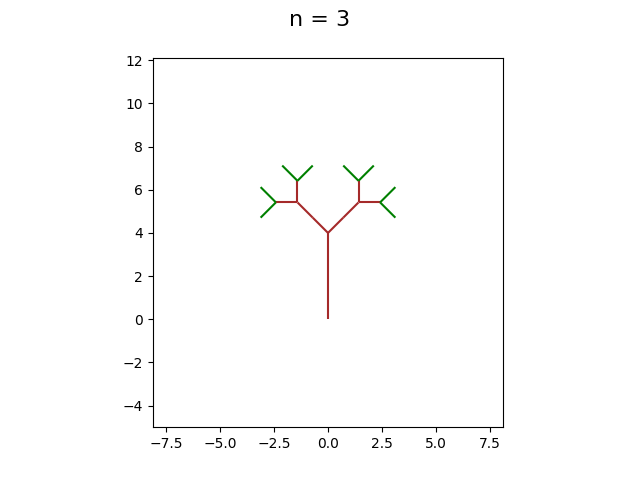
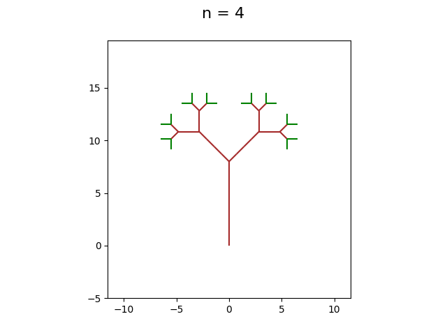
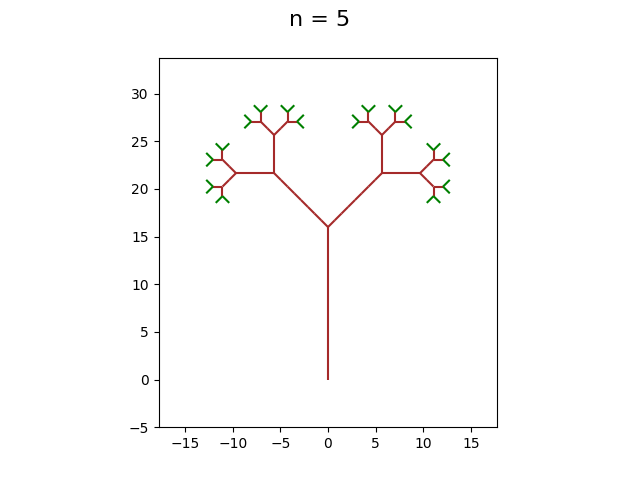

# L-system

A simulator of [L-systems](https://en.wikipedia.org/wiki/L-system) written by Python

## Demo
### 1. Algae ([Wikipedia Example 1](https://en.wikipedia.org/wiki/L-system#Example_1:_Algae))
[code](demo/demo1.py)

#### L-system
- variables: `A`, `B`
- constants: none
- axiom: `A`
- rules: `A→AB`, `B→A`

#### Results
```
n = 0: A
n = 1: AB
n = 2: ABA
n = 3: ABAAB
n = 4: ABAABABA
n = 5: ABAABABAABAAB
n = 6: ABAABABAABAABABAABABA
n = 7: ABAABABAABAABABAABABAABAABABAABAAB
```

### 2. Fractal binary tree ([Wikipedia Example 2](https://en.wikipedia.org/wiki/L-system#Example_2:_Fractal_(binary)_tree))
[code](demo/demo2.py)

#### L-system
- variables: `0`, `1`
- constants: `[`, `]`
- axiom: `0`
- rules: `1→11`, `0→1[0]0`

#### Drawing rules
- `0`: go forward with drawing a green segment
- `1`: go forward with drawing a brown segment
- `[`: push the current pose on the stack, turn 45° to the left
- `[`: pop a pose from the stack, turn 45° to the right

#### Results



