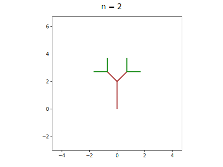
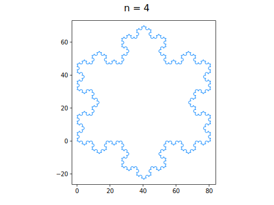
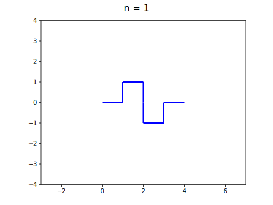
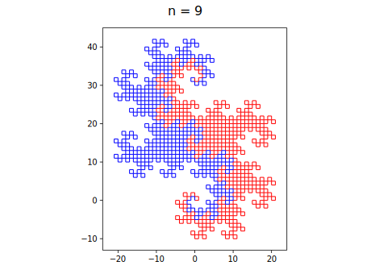
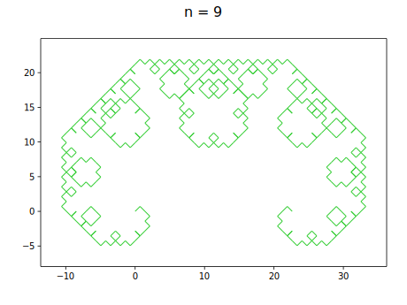
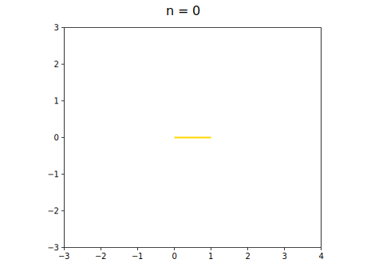

# L-system

This is a Python implementation of [L-systems](https://en.wikipedia.org/wiki/L-system).

The following is a gallery of various mathematical objects that can be described by an L-system.

## Table of Contents
1. [Algae](#1-algae)
1. [Thue-Morse sequence](#2-thue-morse-sequence)
1. [Fractal binary tree](#3-fractal-binary-tree)
1. [Cantor set](#4-cantor-set)
1. [Koch curves](#5-koch-curves)
    1. [Koch snowflake](#5-1-koch-snowflake)
    1. [Quadratic type 1 curve](#5-2-quadratic-type-1-curve)
    1. [Quadratic type 2 curve (aka Minkowski sausage)](#5-3-quadratic-type-2-curve)
1. [Sierpiński triangles](#6-sierpiński-triangles)
    1. [Sierpiński triangle](#6-1-sierpiński-triangle)
    1. [Sierpiński arrowhead curve](#6-2-sierpiński-arrowhead-curve)
1. [Sierpiński curves](#7-sierpiński-curves)
    1. [Sierpiński curve](#7-1-sierpiński-curve)
    1. [Sierpiński square curve](#7-2-sierpiński-square-curve)
1. [Dragon curves](#8-dragon-curves)
    1. [Heighway dragon](#8-1-heighway-dragon)
    1. [Twin dragon](#8-2-twin-dragon)
    1. [Terdragon](#8-3-terdragon)
    1. [Lévy C curve (aka Lévy dragon)](#8-4-lévy-c-curve-aka-lévy-dragon)
1. [Fractal plant](#9-fractal-plant)
1. [Hilbert curve](#10-hilbert-curve)
1. [Peano curve](#11-peano-curve)
1. [Gosper curves](#12-gosper-curves)
    1. [Hexagonal Gosper curve](#12-1-hexagonal-gosper-curve)
    1. [Quadratic Gosper curve](#12-2-quadratic-gosper-curve)
1. [Penrose tiling (P3)](#13-penrose-tiling-p3)
1. [Pentigrees](#14-pentigrees)
    1. [Pentigree](#14-1-pentigree)
    1. [Pentadendrite](#14-2-pentadendrite)

## 1. Algae
[code](demo/algae.py)

### L-system
- variables: `A`, `B`
- constants: none
- axiom: `A`
- rules: `A→AB`, `B→A`

### Results
```
n = 0: A
n = 1: AB
n = 2: ABA
n = 3: ABAAB
n = 4: ABAABABA
n = 5: ABAABABAABAAB
n = 6: ABAABABAABAABABAABABA
n = 7: ABAABABAABAABABAABABAABAABABAABAAB
```

## 2. Thue-Morse sequence
[code](demo/thue-morse_sequence.py)

### L-system
- variables: `0`, `1`
- constants: none
- axiom: `0`
- rules: `0→01`, `1→10`

### Results
```
n = 0: 0
n = 1: 01
n = 2: 0110
n = 3: 01101001
n = 4: 0110100110010110
n = 5: 01101001100101101001011001101001
n = 6: 0110100110010110100101100110100110010110011010010110100110010110
```

## 3. Fractal binary tree
[code](demo/binary_tree.py)

### L-system
- variables: `0`, `1`
- constants: `[`, `]`
- axiom: `0`
- rules: `1→11`, `0→1[0]0`

### Drawing rules
- `0`: go forward with drawing a green line segment
- `1`: go forward with drawing a brown line segment
- `[`: push the current pose on the stack, turn 45° to the left
- `[`: pop a pose from the stack, turn 45° to the right

### Results



## 4. Cantor set
[code](demo/cantor_set.py)

### L-system
- variables: `F`, `f`
- constants: none
- axiom: `F`
- rules: `F→FfF`, `f→fff`

### Drawing rules
- `F`: go forward with drawing a line segment
- `f`: go forward without drawing

### Results


## 5. Koch curves

### 5-1. Koch snowflake
[code](demo/koch_snowflake.py)
#### L-system
- variables: `F`
- constants: `+`, `-`
- axiom: `F--F--F`
- rules: `F→F+F--F+F`

#### Drawing rules
- `F`: go forward with drawing a line segment
- `+`: turn 60° to the left
- `-`: turn 60° to the right

#### Results



### 5-2. Quadratic type 1 curve
[code](demo/koch_quadratic_1.py)
#### L-system
- variables: `F`
- constants: `+`, `-`
- axiom: `F`
- rules: `F→F+F-F-F+F`

#### Drawing rules
- `F`: go forward with drawing a line segment
- `+`: turn 90° to the left
- `-`: turn 90° to the right

#### Results


### 5-3. Quadratic type 2 curve (aka Minkowski sausage)
[code](demo/koch_quadratic_2.py)
#### L-system
- variables: `F`
- constants: `+`, `-`
- axiom: `F`
- rules: `F→F+F-F-FF+F+F-F`

#### Drawing rules
- `F`: go forward with drawing a line segment
- `+`: turn 90° to the left
- `-`: turn 90° to the right

#### Results



## 6. Sierpiński triangles

### 6-1. Sierpiński triangle
[code](demo/sierpinski_triangle.py)

#### L-system
- variables: `F`, `G`
- constants: `+`, `-`
- axiom: `F-G-G`
- rules: `F→F-G+F+G-F`, `G→GG`

#### Drawing rules
- `F`: go forward with drawing a red line segment
- `G`: go forward with drawing a yellow line segment
- `+`: turn 120° to the left
- `-`: turn 120° to the right

#### Results


### 6-2. Sierpiński arrowhead curve
[code](demo/sierpinski_arrowhead_curve.py)

#### L-system
- variables: `F`, `G`
- constants: `+`, `-`
- axiom: `F`
- rules: `F→G-F-G`, `G→F+G+F`

#### Drawing rules
- `F`: go forward with drawing a red line segment
- `G`: go forward with drawing a blue line segment
- `+`: turn 60° to the left
- `-`: turn 60° to the right

#### Results


## 7. Sierpiński curves

### 7-1. Sierpiński curve
[code](demo/sierpinski_curve.py)

#### L-system
- variables: `X`
- constants: `F`, `+`, `-`
- axiom: `F--XF--F--XF`
- rules: `X→XF+G+XF--F--XF+G+X`

#### Drawing rules
- `X`: do nothing
- `F`: go forward with drawing an orange line segment
- `G`: go forward with drawing a brown line segment
- `+`: turn 45° to the left
- `-`: turn 45° to the right

#### Results


### 7-2. Sierpiński square curve
[code](demo/sierpinski_square_curve.py)

#### L-system
- variables: `X`
- constants: `F`, `+`, `-`
- axiom: `F+XF+F+XF`
- rules: `X→XF-F+F-XF+F+XF-F+F-X`

#### Drawing rules
- `X`: do nothing
- `F`: go forward with drawing a line segment
- `+`: turn 90° to the left
- `-`: turn 90° to the right

#### Results


## 8. Dragon curves

### 8-1. Heighway dragon
[code](demo/heighway_dragon.py)

#### L-system
- variables: `F`, `G`
- constants: `+`, `-`
- axiom: `F`
- rules: `F→F+G`, `G→F-G`

#### Drawing rules
- `F`: go forward with drawing a red line segment
- `G`: go forward with drawing a green line segment
- `+`: turn 90° to the left
- `-`: turn 90° to the right

#### Results


### 8-2. Twin dragon
[code](demo/twin_dragon.py)

#### L-system
- variables: `F`, `G`, `X`, `Y`
- constants: `+`, `-`
- axiom: `F+G+X+Y`
- rules: `F→F+G`, `G→F-G`, `X→X+Y`, `Y→X-Y`

#### Drawing rules
- `F`: go forward with drawing a red line segment
- `G`: go forward with drawing a red line segment
- `X`: go forward with drawing a blue line segment
- `Y`: go forward with drawing a blue line segment
- `+`: turn 90° to the left
- `-`: turn 90° to the right

#### Results





### 8-3. Terdragon
[code](demo/terdragon.py)

#### L-system
- variables: `F`, `G`, `H`
- constants: `+`, `-`
- axiom: `F+G-H`
- rules: `F→F+F-F`, `G→G+G-G`, `H→H+H-H`

#### Drawing rules
- `F`: go forward with drawing a red line segment
- `G`: go forward with drawing a green line segment
- `H`: go forward with drawing a blue line segment
- `+`: turn 120° to the left
- `-`: turn 120° to the right

#### Results


### 8-4. Lévy C curve (aka Lévy dragon)
[code](demo/levy_c_curve.py)

#### L-system
- variables: `F`
- constants: `+`, `-`
- axiom: `F`
- rules: `F→+F--F+`

#### Drawing rules
- `F`: go forward with drawing a line segment
- `+`: turn 45° to the left
- `-`: turn 45° to the right

#### Results





## 9. Fractal plant
[code](demo/fractal_plant.py)

### L-system
- variables: `X`, `F`
- constants: `+`, `-`, `[`, `]`
- axiom: `X`
- rules: `X→F+[[X]-X]-F[-FX]+X`, `F→FF`

### Drawing rules
- `X`: do nothing
- `F`: go forward with drawing a line segment
- `+`: turn 25° to the left
- `-`: turn 25° to the right
- `[`: push the current pose on the stack
- `]`: pop a pose from the stack

### Results


## 10. Hilbert curve
[code](demo/hilbert_curve.py)

### L-system
- variables: `A`, `B`
- constants: `F`, `+`, `-`
- axiom: `A`
- rules: `A→+BF-AFA-FB+`, `B→-AF+BFB+FA-`

### Drawing rules
- `A`: do nothing
- `B`: do nothing
- `F`: go forward with drawing a line segment
- `+`: turn 90° to the left
- `-`: turn 90° to the right

### Results


## 11. Peano curve
[code](demo/peano_curve.py)

### L-system
- variables: `A`, `B`
- constants: `F`, `+`, `-`
- axiom: `A`
- rules: `A→AFBFA-F-BFAFB+F+AFBFA`, `B→BFAFB+F+AFBFA-F-BFAFB`

### Drawing rules
- `A`: do nothing
- `B`: do nothing
- `F`: go forward with drawing a line segment
- `+`: turn 90° to the left
- `-`: turn 90° to the right

### Results


## 12. Gosper curves

### 12-1. Hexagonal Gosper curve
[code](demo/hexagonal_gosper_curve.py)

#### L-system
- variables: `F`, `G`
- constants: `+`, `-`
- axiom: `F`
- rules: `F→F-G--G+F++FF+G-`, `G→+F-GG--G-F++F+G`

#### Drawing rules
- `F`: go forward with drawing a green line segment
- `G`: go forward with drawing a blue line segment
- `+`: turn 60° to the left
- `-`: turn 60° to the right

#### Results


### 12-2. Quadratic Gosper curve
[code](demo/quadratic_gosper_curve.py)

#### L-system
- variables: `F`, `G`
- constants: `+`, `-`
- axiom: `G`
- rules: `F→FF-G-G+F+F-G-GF+G+FFG-F+G+FF+G-FG-G-F+F+GG-`, `G→+FF-G-G+F+FG+F-GG-F-G+FGG-F-GF+F+G-G-F+F+GG`

#### Drawing rules
- `F`: go forward with drawing a green line segment
- `G`: go forward with drawing a blue line segment
- `+`: turn 90° to the left
- `-`: turn 90° to the right

#### Results



## 13. Penrose tiling (P3)
[code](demo/penrose_tiling_P3.py)

### L-system
- variables: `F`, `1`, `2`, `3`, `4`
- constants: `+`, `-`, `[`, `]`
- axiom: `[2]++[2]++[2]++[2]++[2]`
- rules:
    - `F→(empty)`
    - `1→3F++4F----2F[-3F----1F]++`
    - `2→+3F--4F[---1F--2F]+`
    - `3→-1F++2F[+++3F++4F]-`
    - `4→--3F++++1F[+4F++++2F]--2F`

### Drawing rules
- `F`: go forward with drawing a line segment
- `1`: do nothing
- `2`: do nothing
- `3`: do nothing
- `4`: do nothing
- `+`: turn 36° to the left
- `-`: turn 36° to the right
- `[`: push the current pose on the stack
- `]`: pop a pose from the stack

### Results


## 14. Pentigrees

### 14-1. Pentigree
[code](demo/pentigree.py)

#### L-system
- variables: `1`, `2`, `3`, `4`, `5`
- constants: `+`, `-`
- axiom: `1++2++3++4++5`
- rules:
    - `1→+1++1----1--1++1++1-`
    - `2→+2++2----2--2++2++2-`
    - `3→+3++3----3--3++3++3-`
    - `4→+4++4----4--4++4++4-`
    - `5→+5++5----5--5++5++5-`

#### Drawing rules
- `1`: go forward with drawing a red line segment
- `2`: go forward with drawing a yellow line segment
- `3`: go forward with drawing a green line segment
- `4`: go forward with drawing a blue line segment
- `5`: go forward with drawing a purple line segment
- `+`: turn 36° to the left
- `-`: turn 36° to the right

#### Results


### 14-1. Pentadendrite
[code](demo/pentadendrite.py)

#### L-system
- variables: `1`, `2`, `3`, `4`, `5`
- constants: `+`, `-`
- axiom: `1+2+3+4+5`
- rules:
    - `1→1+1-1--1+1+1`
    - `2→2+2-2--2+2+2`
    - `3→3+3-3--3+3+3`
    - `4→4+4-4--4+4+4`
    - `5→5+5-5--5+5+5`

#### Drawing rules
- `1`: go forward with drawing a red line segment
- `2`: go forward with drawing a yellow line segment
- `3`: go forward with drawing a green line segment
- `4`: go forward with drawing a blue line segment
- `5`: go forward with drawing a purple line segment
- `+`: turn 72° to the left
- `-`: turn 72° to the right

#### Results


## References
- Przemyslaw Prusinkiewicz and Aristid Lindenmayer. *The Algorithmic Beauty of Plants*, Springer-Verlag, 1990.
- Lawrence H. Riddle, Classic Iterated Function Systems, https://larryriddle.agnesscott.org/ifs/ifs.htm
- StackExchange - Does there exist an L-system for the sierpiński curve, https://math.stackexchange.com/questions/3393187
- Wikipedia articles
    - https://en.wikipedia.org/wiki/L-system
    - https://en.wikipedia.org/wiki/Thue%E2%80%93Morse_sequence
    - https://en.wikipedia.org/wiki/Koch_snowflake
    - https://en.wikipedia.org/wiki/Sierpi%C5%84ski_curve
    - https://en.wikipedia.org/wiki/Hilbert_curve
    - https://en.wikipedia.org/wiki/Peano_curve
    - https://en.wikipedia.org/wiki/Gosper_curve
    - https://en.wikipedia.org/wiki/Dragon_curve
    - https://es.wikipedia.org/wiki/Teselaci%C3%B3n_de_Penrose
